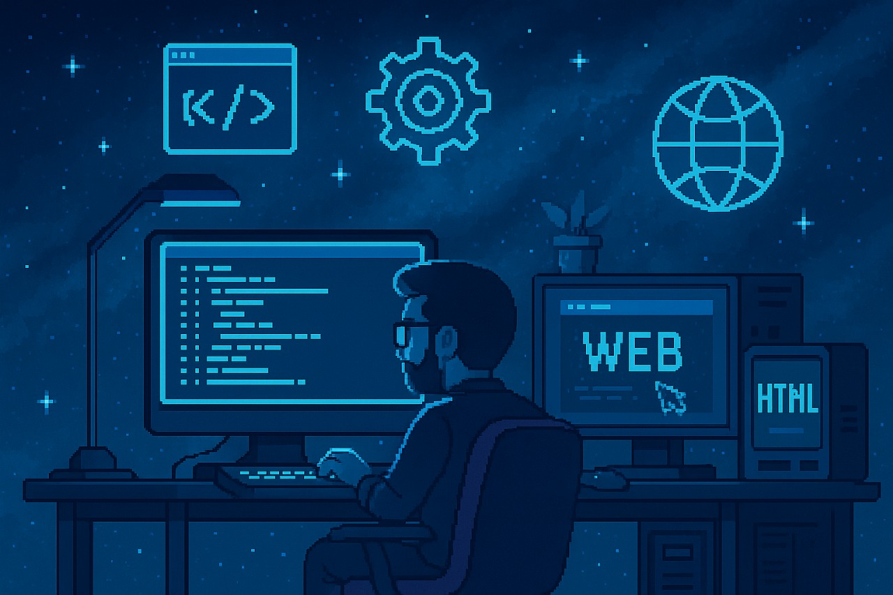

<h1 align="center">Hi, I'm Kiran </h1>
<h3 align="center">💻 Passionate Developer | 🌐 Web Enthusiast | 🇮🇳 From India</h3>

  🎓 Computer Science Student | 🔭 Currently exploring the world of full-stack development and beyond. 
  Always eager to learn, build, and contribute to exciting tech projects.

---

<h2 align="center">🛠️ Tech Stack</h2>

  
  
  
  
  
  
  
  
  
  
  
  
  
  
  
  
  
  
  
  
  
  

<h2 align="center">📬 Let's Connect</h2>

  
  

---

  ⚡ *"Keep building. Keep learning. Keep growing."*

